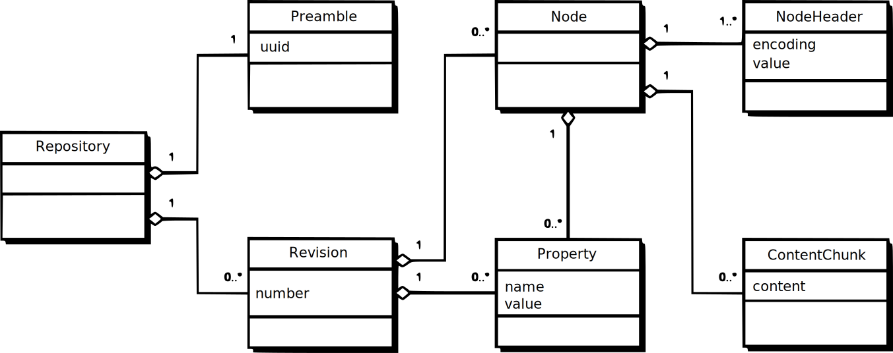

# SVN Dump API

An API for editing SVN dump files.

## Background

SVN dump files are created via the `svnadmin dump` command, and contain all the 
history of an SVN repository.  An SVN dump file contains a list of revisions 
(see [`Revision`](src/main/java/com/github/cstroe/svndumpgui/api/Revision.java)), and each
revision contains a list of nodes (see [`Node`](src/main/java/com/github/cstroe/svndumpgui/api/Node.java)).

Revisions can have properties such as author, date, and commit message.  Nodes 
can have properties too, which are maintained on a node by node basis.

## Related Work

I'm not the first one to have this idea.  Here are some links:
* [svndumpfilter](http://svnbook.red-bean.com/en/1.8/svn.ref.svndumpfilter.html): comes with svn, limited functionality
* [svndumpmultitool](https://github.com/emosenkis/svndumpmultitool): very similar project to this one, written in Python

## Model

## SVNDumpFileParser

The `SvnDumpFileParser` is an auto-generated parser for SVN dump files 
(files [created with `svnadmin dump`](src/test/resources/dumps)).  It will
parse SVN dump files into a [`Repository`](src/main/java/com/github/cstroe/svndumpgui/api/Repository.java) object.
The `Repository` representation is
meant to be very light-weight and does minimal validation.

The parser is auto-generated using JavaCC from the [`svndump.jj`](src/main/javacc/svndump.jj) gramar file.
This grammar generates a parser that is dependenent on the Java interfaces and 
classes in this project.

## Repository Summary

To get an `svn log`-like summary of your dump file, you can use the 
[`RepositorySummary`](src/main/java/com/github/cstroe/svndumpgui/internal/writer/RepositorySummary.java) (sample output [here](src/test/resources/summary/svn_multi_file_delete.txt)).

## Consumers

A [`RepositoryConsumer`](src/main/java/com/github/cstroe/svndumpgui/api/RepositoryConsumer.java) consumes the various pieces of a [`Repository`](src/main/java/com/github/cstroe/svndumpgui/api/Repository.java).  Specializations of a consumer are:

* [`RepositoryMutator`](src/main/java/com/github/cstroe/svndumpgui/api/RepositoryMutator.java): changes the Repository in some way
* [`RepositoryValidator`](src/main/java/com/github/cstroe/svndumpgui/api/RepositoryValidator.java): validates the correctness of the Repository in some way
* [`RepositoryWriter`](src/main/java/com/github/cstroe/svndumpgui/api/RepositoryWriter.java): write the Repository in some format

Consumers (and therefore any of its specializations) can be chained together to achieve complex operations on SVN dump files using the `continueTo(RepositoryConsumer)` method.

## Mutators

The API allows for changing of an SVN dump file via 
[`RepositoryMutator`](src/main/java/com/github/cstroe/svndumpgui/api/RepositoryMutator.java) implementations.

Some useful mutators are:
* [`ClearRevision`](src/main/java/com/github/cstroe/svndumpgui/internal/transform/ClearRevision.java) - empties a revision (removes all changes, revision is preserved)
* [`PathChange`](src/main/java/com/github/cstroe/svndumpgui/internal/transform/PathChange.java) - updates file/dir paths
* [`NodeRemove`](src/main/java/com/github/cstroe/svndumpgui/internal/transform/NodeRemove.java) - removes an individual file change from a revision
* [`NodeAdd`](src/main/java/com/github/cstroe/svndumpgui/internal/transform/NodeAdd.java) - add some newly crafted change to a specific revision
* [`NodeHeaderChange`](src/main/java/com/github/cstroe/svndumpgui/internal/transform/NodeHeaderChange.java) - change a specific property on an existing SvnNode

To apply multiple mutators in sequence, you can chain them together, using `RepositoryConsumer.continueTo(RepositoryConsumer)`.

## Validators

When you start messing with your SVN history via the mutators, you can be left
with an SVN dump file that cannot be imported back into an SVN repository.  To
 make changing SVN history easier the API has the concept of an 
 [`RepositoryValidator`](src/main/java/com/github/cstroe/svndumpgui/api/RepositoryValidator.java).
 
Validation is done while the data is in memory, which is much faster
than running it through `svnadmin load`.

Some useful validators:
* [`PathCollision`](src/main/java/com/github/cstroe/svndumpgui/internal/validate/PathCollision.java) - checks that file operations are valid (don't delete non-existent files, don't double add files, check that files exist when making copies)

# Usage

## Command Line Interface

The `bin/run-java` shell script will run the `CliConsumer`.  
The current usage pattern is to modify the `CliConsumer` and create your chain programmatically, then do:

    mvn clean install
    cat file.dump | ./bin/run-java > output.dump

or, if your repository is too large for a single file:

    mvn clean install
    svnadmin create /path/to/newrepo
    svnadmin dump /path/to/repo | ./bin/run-java | svnadmin load -q /path/to/newrepo

## Example: AgreementMaker

To see how all these pieces fit together to allow you to edit SVN history,
you can look at a SVN repository cleanup that I did for the AgreementMaker project.
All the operations to the SVN dump file are detailed in [this test](src/test/java/com/github/cstroe/svndumpgui/internal/AMDump.java).

## Reading an SVN dump file

Parsing an SVN dump file is straight forward.  Here's an example that uses a single consumer (writes the SVN dump to STD OUT):

    RepositoryWriter writer = new RepositoryWriterImpl();
    writer.writeTo(System.out);
    
    InputStream is = new FileInputStream("svn.dump");
    SvnDumpFileParser.consume(is, writer);

See [`SvnDumpFileParserTest`](src/test/java/com/github/cstroe/svndumpgui/internal/SvnDumpFileParserTest.java) for usage patterns of the parser.
